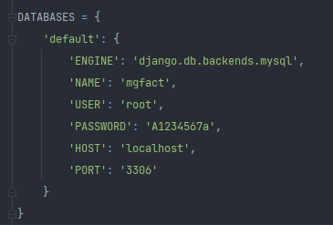

# Sistema básico de facturación 

## Instalación

- Se recomienda ser desplegado en un entorno virtual
- La base de datos para esta aplicativo es en MySQL o MariaDB, por lo que se asume que en la maquina donde se desplegará ya se encuentra funcionando y en el puerto estándar 3306, con un tipo de red TCP/IP.
- Para crear la base de datos es necesario correr el script *script_BD.py* desde la terminal, o ejecutando el script *script_Mariadb.sql* directamente en su gestor de Base de Datos.
- Luego de tener lo anterior, es necesario configurar el archivo py *settings.py* que se encuentra en la carpeta *mgFact/*



- Cambiar la configuración de acuerdo a las configuraciones de su Base de Datos
- Ejecutar el Script *utils.py* que creara un superusuario y asignara un token necesario para acceder al aplicativo.


## Uso

Se crea archivo de migraciones:
```bash
python manage makemigrations
```
Luego se aplican las migraciones
```bash
python manage migrate
```
Para correr el servidor local de Django:
```bash
python manage runserver
```
## Endpoint o Rutas principales

- "user": "http://127.0.0.1:8000/user/",
- "client": "http://127.0.0.1:8000/client/",
- "seller": "http://127.0.0.1:8000/seller/",
- "type-product": "http://127.0.0.1:8000/type-product/",
- "product": "http://127.0.0.1:8000/product/",
- "inovice": "http://127.0.0.1:8000/inovice/",
- "invoice-detail": "http://127.0.0.1:8000/invoice-detail/"
- "Login": "http://127.0.0.1:8000/api-auth/"

Se utilizó Django Rest Framework, para la genaración de token